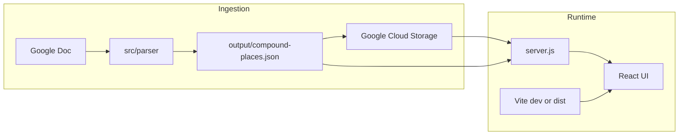
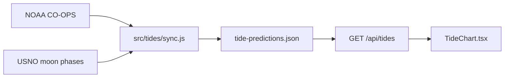

# Architecture

Teddy Sheddy (the-compound) is a visitor guide: React frontend, Express API, and a Node parser that ingests a Google Doc and produces structured place data.

## Data flow



### Parser (in-app AI)

The parser under `src/parser/` uses OpenAI and Langchain to:

1. Fetch content from a configured Google Doc
2. Extract places, categories, and house-mechanics sections
3. Optionally enrich via Google Places API
4. Write `compound-places.json` to `src/parser/output/`
5. Upload to GCS when `GOOGLE_CLOUD_STORAGE_ENABLED` is not `false`

This is **product AI** (data pipeline), not tooling for coding agents. See [AGENTS.md](../../AGENTS.md) at repo root for agent workflows.

### Places data serving

| Mode | Source |
|------|--------|
| GCS enabled (default) | `google-cloud-storage.js` → `GET /api/compound-places` |
| GCS disabled | `public/compound-places.json` (copied from parser output or `npm run seed-local`) |

### House mechanics

| Mode | Source |
|------|--------|
| GCS enabled | `house-mechanics-{lofty\|shady}.md` in bucket |
| GCS disabled | `fixtures/house-mechanics/house-mechanics-{lofty\|shady}.md` |

Served only via authenticated API — **not** from `public/` (avoids static exposure in `dist/`).

### Tides

`src/tides/` is a self-contained module, deliberately isolated from `src/parser/` — it must not
require `src/parser/config.js` (which throws at load time if OpenAI/Google env vars are missing),
because `/tides` is a public route with no dependency on the parser.



- NOAA CO-OPS `datagetter` (hi-lo predictions) and USNO's moon-phase API are both keyless.
- There is no scheduler (`Procfile` is `web: npm run start` only), so coverage is maintained by a
  **lazy self-heal**: each `/api/tides` request checks cache coverage and fires a mutexed,
  backed-off background refetch (`ensureCoverage` in `sync.js`) if it's running low — the request
  itself always serves whatever is cached, stale or not.
- `npm run sync-tides` / `sync-tides:force` run the same sync from the CLI for manual/first runs.

| Mode | Source |
|------|--------|
| GCS enabled | `tide-predictions.json` in bucket |
| GCS disabled | `public/tide-predictions.json` (synced), falling back to `fixtures/tide-predictions.sample.json` |

The committed fixture (Aug 2026 + Nov 2027, including the DST double-low-tide day) means a fresh
clone with no `.env` still renders a working tide chart.

## API surface (`server.js`)

| Method | Path | Auth | Description |
|--------|------|------|-------------|
| POST | `/api/auth/login` | — | Password login → JWT |
| GET | `/api/auth/verify` | Bearer | Validate token |
| GET | `/api/compound-places` | — | Places JSON |
| GET | `/api/house-mechanics/:house` | guest or admin | Markdown for `lofty` or `shady` |
| GET | `/api/tides` | — | One month of tide predictions (`?month=YYYY-MM`, defaults to current) |
| POST | `/api/admin/parse` | admin | Run parser (sync) |
| POST | `/api/admin/parse-polling` | admin | Start parser (async) |
| GET | `/api/admin/parse-status` | admin | Parser job status |
| POST | `/api/admin/parse-stop` | admin | Stop parser job |
| GET | `/api/admin/google-doc-url` | admin | Link to source doc |
| GET | `/api/admin/download-output` | admin | Download places JSON |
| POST | `/api/admin/places/preview` | admin | Resolve free-text place (Places + LLM); no writes |
| POST | `/api/admin/places/commit` | admin | Append place to Google Doc + `compound-places.json` |

Static SPA: `express.static('dist')` + `GET *` → `index.html`.

## Frontend

- **Vite** dev server on :5173 proxies `/api` → :3000
- **React Router** routes in `App.tsx`
- **Auth**: `AuthContext` + `ProtectedRoute` (guest/admin)
- **Places**: `PlacesList` fetches `/api/compound-places`; inline sample data if 404
- **Tides**: `TideChart` (public, `/tides`) fetches `/api/tides` via the `useTides` hook, which
  keeps a client-side per-month cache so paging back and forth doesn't re-request

## Local development

```bash
npm run dev:all      # Vite + Express
npm run seed-local   # Optional: sample places for API without parser
npm run sync-tides   # Optional: force a real tide sync (works with zero .env)
```

## Deployment

Heroku runs from `app/` via git subtree. See [DEPLOYMENT.md](./DEPLOYMENT.md).
