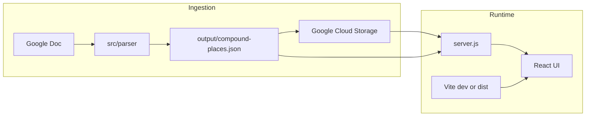

# Architecture

Teddy Sheddy (the-compound) is a visitor guide: React frontend, Express API, and a Node parser that ingests a Google Doc and produces structured place data.

## Data flow



### Parser (in-app AI)

The parser under `src/parser/` uses OpenAI and Langchain to:

1. Fetch content from a configured Google Doc
2. Extract places, categories, and house-mechanics sections
3. Optionally enrich via Google Places API
4. Write `compound-places.json` to `src/parser/output/`
5. Upload to GCS when `GOOGLE_CLOUD_STORAGE_ENABLED` is not `false`

This is **product AI** (data pipeline), not tooling for coding agents. See [AGENTS.md](../../AGENTS.md) at repo root for agent workflows.

### Places data serving

| Mode | Source |
|------|--------|
| GCS enabled (default) | `google-cloud-storage.js` → `GET /api/compound-places` |
| GCS disabled | `public/compound-places.json` (copied from parser output or `npm run seed-local`) |

### House mechanics

| Mode | Source |
|------|--------|
| GCS enabled | `house-mechanics-{lofty\|shady}.md` in bucket |
| GCS disabled | `fixtures/house-mechanics/house-mechanics-{lofty\|shady}.md` |

Served only via authenticated API — **not** from `public/` (avoids static exposure in `dist/`).

## API surface (`server.js`)

| Method | Path | Auth | Description |
|--------|------|------|-------------|
| POST | `/api/auth/login` | — | Password login → JWT |
| GET | `/api/auth/verify` | Bearer | Validate token |
| GET | `/api/compound-places` | — | Places JSON |
| GET | `/api/house-mechanics/:house` | guest or admin | Markdown for `lofty` or `shady` |
| POST | `/api/admin/parse` | admin | Run parser (sync) |
| POST | `/api/admin/parse-polling` | admin | Start parser (async) |
| GET | `/api/admin/parse-status` | admin | Parser job status |
| POST | `/api/admin/parse-stop` | admin | Stop parser job |
| GET | `/api/admin/google-doc-url` | admin | Link to source doc |
| GET | `/api/admin/download-output` | admin | Download places JSON |

Static SPA: `express.static('dist')` + `GET *` → `index.html`.

## Frontend

- **Vite** dev server on :5173 proxies `/api` → :3000
- **React Router** routes in `App.tsx`
- **Auth**: `AuthContext` + `ProtectedRoute` (guest/admin)
- **Places**: `PlacesList` fetches `/api/compound-places`; inline sample data if 404

## Local development

```bash
npm run dev:all    # Vite + Express
npm run seed-local # Optional: sample places for API without parser
```

## Deployment

Heroku runs from `app/` via git subtree. See [DEPLOYMENT.md](./DEPLOYMENT.md).
